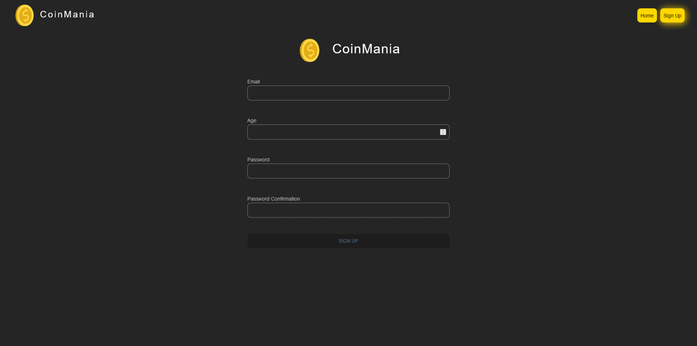

# CoinMania in React Vite

## Description

CoinMania is a web application developed with React and Vite, tailored for cryptocurrency enthusiasts and traders. It combines robust product management with real-time data visualization from the CoinCap API. The application features an intuitive Bootstrap-based interface, seamless form validation with Formik and Yup, and dynamic cryptocurrency charts powered by react-chart-js. With integrations like react-icons for visual enhancements and numeral for number formatting, CoinMania caters to both beginners and experienced traders in the cryptocurrency market.

## Features

- Product management functionality
- Integration with CoinCap API for real-time cryptocurrency data
- Responsive design with Bootstrap
- Form validation using Formik and Yup
- Charts powered by react-chart-js
- Styling with Sass

## Libraries

- **axios**: Promise-based HTTP client for the browser and Node.js.
- **uuid**: Library for generating unique identifiers.
- **react-router-dom**: Declarative routing for React applications.
- **sass**: CSS extension language.
- **yup**: JavaScript schema builder for value parsing and validation.
- **formik**: Form library for React and React Native.
- **bootstrap**: Front-end framework for developing responsive projects.
- **react-icons**: Popular icons for React projects.
- **numeral**: Formatting and manipulating numbers library.
- **millify**: Library for converting numbers into readable strings.
- **Tilt**: React parallax tilt effect for elements.
- **react-chart-js**: React wrapper for Chart.js library.

## API

The project utilizes the CoinCap API for fetching real-time cryptocurrency data. Documentation can be found at [CoinCap API Documentation](https://docs.coincap.io/).

## Preview



## Deployment

The project is deployed and can be accessed [here](https://chimerical-swan-91a6b2.netlify.app/). For the project to run smoothly, please follow the installation steps below to set it up locally.The project may behave differently across different browsers.

## Installation

To run the project locally, follow these steps:

1. Clone the repository:

```bash
git clone https://github.com/KamilErdogmus/CoinMania.git
```

2. Navigate to the project directory:

```bash
cd your-repository
```

3. Install dependencies:

```bash
npm install
```

4. Start the development server:

```bash
npm start / npm run dev
```

5. Open your web browser and visit http://localhost:3000 to view the application.
